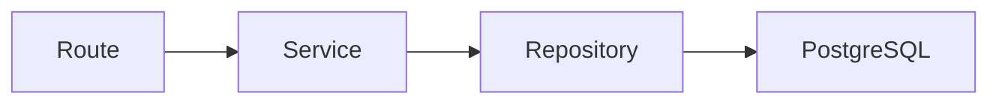
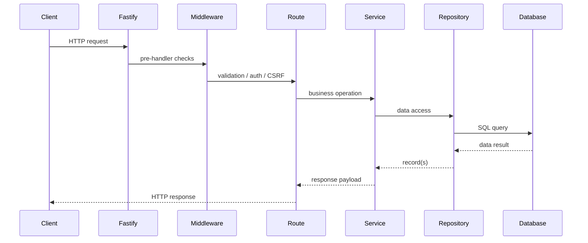
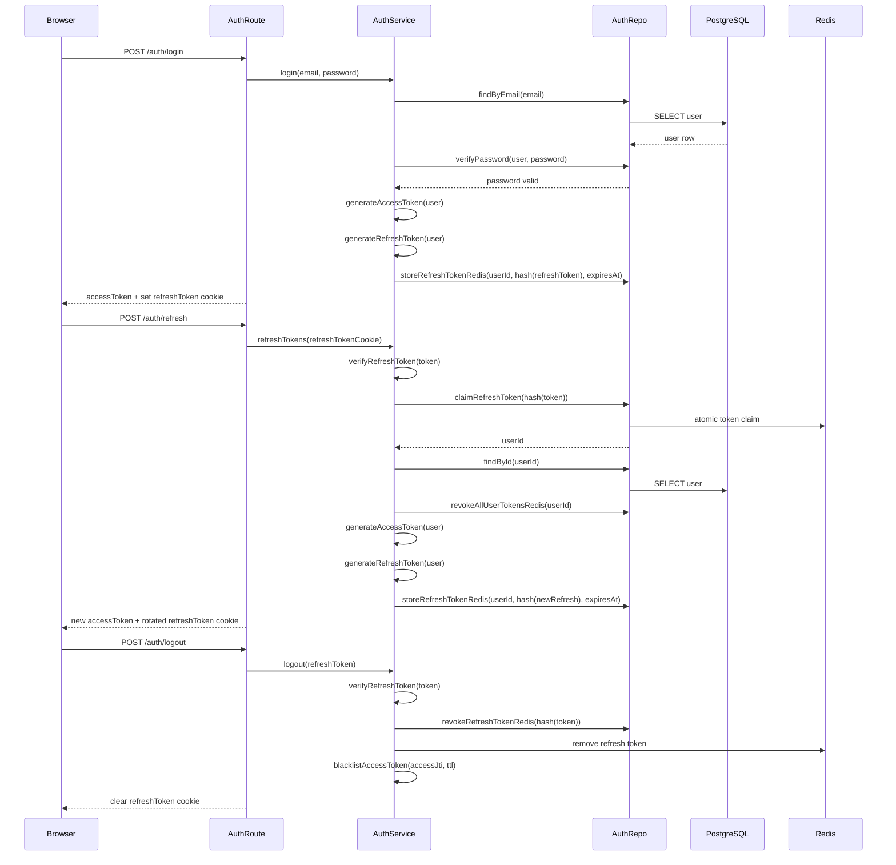
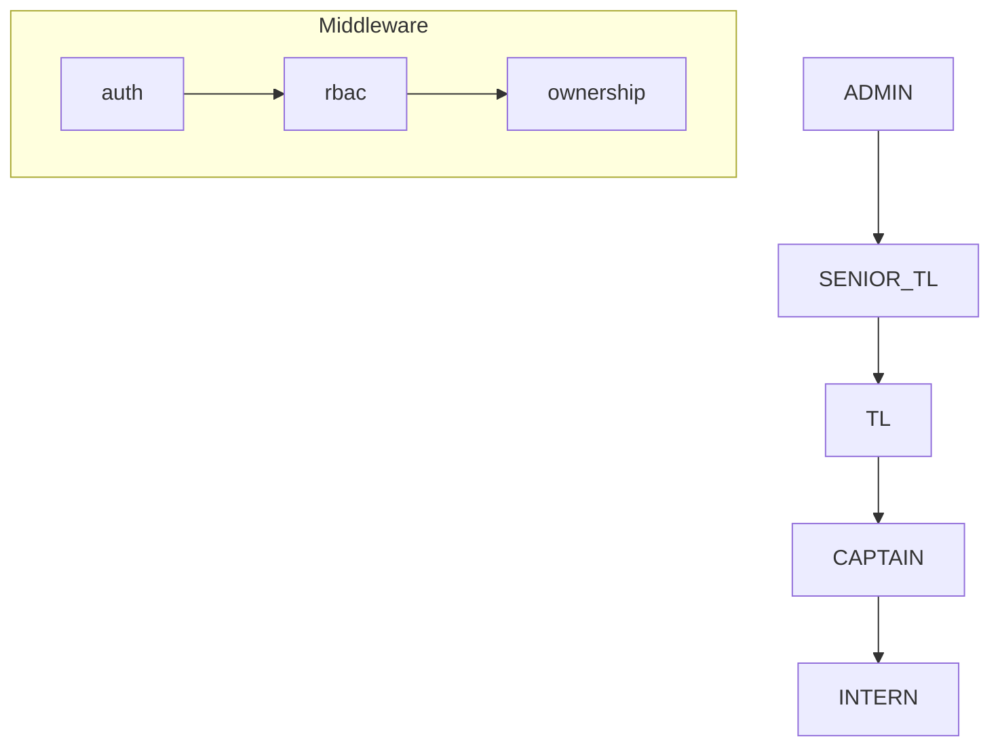
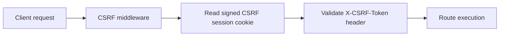
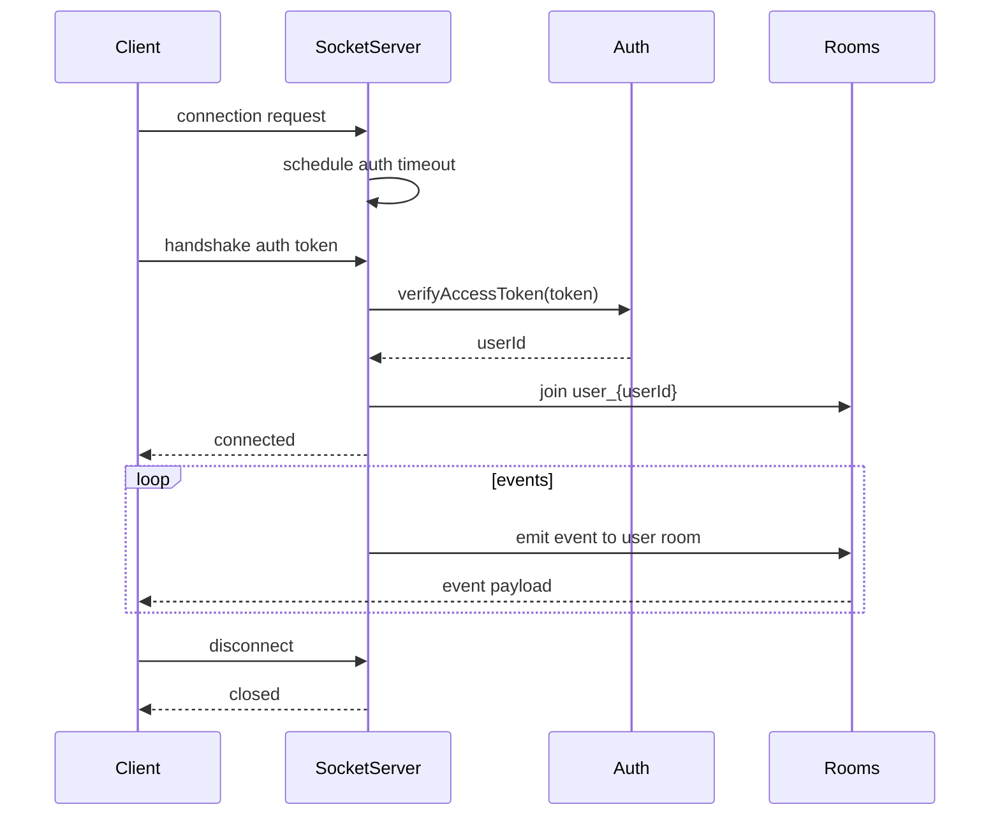
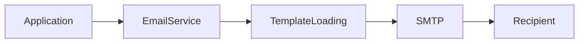
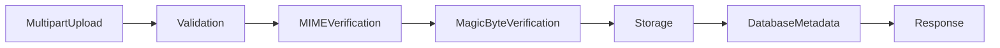
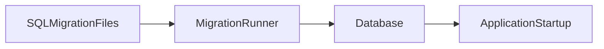

# Architecture

## Table of Contents

1. [System Overview](#1-system-overview)
2. [Project Architecture](#2-project-architecture)
3. [Module Interaction](#3-module-interaction)
4. [Authentication Flow](#4-authentication-flow)
5. [Authorization Model](#5-authorization-model)
6. [CSRF Protection](#6-csrf-protection)
7. [WebSocket Lifecycle](#7-websocket-lifecycle)
8. [Email Pipeline](#8-email-pipeline)
9. [File Upload Flow](#9-file-upload-flow)
10. [Database Migration](#10-database-migration)
11. [Folder Structure](#11-folder-structure)

---

## 1. System Overview

InternOps is implemented as a split front-end / back-end application.

- Frontend: React app built with Vite, located in `frontend/`.
- Backend: Fastify-based Node.js API server under `backend/src/`.
- Database: PostgreSQL stores application data and migration metadata.
- Authentication: JWT access and refresh tokens are used for session management.
- WebSocket: Socket.IO is used for real-time notifications and user-specific channels.
- Email service: nodemailer-backed service loads templates and sends emails with retry and bounce handling.
- File uploads: Fastify multipart upload with MIME and magic-byte validation, then stored on disk and recorded in PostgreSQL.

The backend centralizes API routing under `/api/v1` and `/api/v2`, with shared middleware for auth, CSRF, sanitization, and rate limiting.

---

## 2. Project Architecture

The backend follows a modular structure. Each module owns the business routes for one domain, and most modules separate concerns into:

- `Route` — HTTP entrypoints and Fastify route registration.
- `Service` — business logic, validation, and orchestration.
- `Repository` — direct PostgreSQL interaction.
- `PostgreSQL` — persistent storage.

This separation exists to keep each responsibility isolated:

- Routes stay thin and handle request/response details.
- Services implement application rules and workflow.
- Repositories provide a stable data access layer.
- PostgreSQL remains the source of truth for persistence.

### Backend flow example

Not every module has an explicit service layer, but the same path is preserved where service logic is present.

---

## 3. Module Interaction

A request travels through the backend in defined stages.

This pipeline makes the backend easier to test, reason about, and extend.

---

## 4. Authentication Flow

Authentication is implemented in `backend/src/modules/auth` with access and refresh token lifecycles.

Key points:

- Password verification uses Argon2 hashes stored in PostgreSQL.
- Access tokens are short-lived JWTs validated by `backend/src/utils/tokens.js`.
- Refresh tokens are signed JWTs stored as hashes.
- Refresh flow rotates tokens and revokes previous refresh tokens.
- Logout revokes the refresh token and blacklists the active access token.
- CSRF cookies are rotated on login and logout.

---

## 5. Authorization Model

Authorization is enforced with role-based access control and hierarchy checks.

### Role hierarchy

- `ADMIN`
- `SENIOR_TL`
- `TL`
- `CAPTAIN`
- `INTERN`

### Role capabilities

- `ADMIN`: full access via `rbac('ADMIN')` or `all` permission.
- `SENIOR_TL`: elevated team and report access.
- `TL`: team and attendance access.
- `CAPTAIN`: read-only team access.
- `INTERN`: own profile access.

### Ownership and hierarchy validation

- `ownership()` middleware validates that the authenticated user may act on the target user resource.
- `utils/hierarchy.js` resolves department membership and manager chains recursively.
- Admin bypasses ownership checks.

### Middleware order

- `auth` verifies the access token and populates `request.user`.
- `rbac` checks allowed actions or role-specific requirements.
- `ownership` enforces target-user hierarchy / ownership rules.

This ordering ensures authentication is established before role checks, then ownership is validated for hierarchical operations.

---

## 6. CSRF Protection

CSRF is enforced by middleware in `backend/src/middleware/csrf.js`.

- A signed session cookie (`csrf-sid`) is created for the browser.
- A CSRF token cookie (`csrf-token`) is generated from the session ID.
- State-changing requests require the `X-CSRF-Token` header.
- The token is validated using timing-safe comparison.
- Some auth and public endpoints are exempt.

On each login/logout event, the server rotates the CSRF session and token cookies.

---

## 7. WebSocket Lifecycle

WebSocket support is implemented in `backend/src/websocket.js` using Socket.IO.

Key stages:

- Connection is accepted with an auth timeout guard.
- The JWT access token is required in the handshake.
- Authenticated sockets join a room keyed by `user_{userId}`.
- Disconnect cleans up pending connection state.

---

## 8. Email Pipeline

Email delivery is handled by `backend/src/services/email.js`.

- Templates are loaded from `backend/src/services/templates/`.
- Messages are rendered to HTML/text.
- SMTP config is loaded from environment variables.
- If SMTP is not configured, the service falls back to console logging.
- Rate limiting per recipient is enforced with Redis or in-memory fallback.
- Retries are performed on transient failures.
- Rejected recipients are tracked in a bounce list.

Retry and bounce handling are implemented in the email service loop: failed sends are retried and rejected addresses are recorded to prevent repeated delivery attempts.

---

## 9. File Upload Flow

Uploads are handled in `backend/src/modules/uploads/routes.js`.

- Fastify multipart receives the file.
- The route validates MIME type and file extension.
- File size is checked against `MAX_FILE_SIZE`.
- Magic-byte detection verifies the actual file contents.
- The file is written to `uploads/` on disk.
- The upload metadata is updated in the database via repository code.
- A JSON response returns the stored file location.

The upload route also prevents path traversal by resolving and validating the target path against the upload directory.

---

## 10. Database Migration

Migrations use raw SQL files in the repository `migrations/` directory.

- `backend/src/db/migrate.js` reads files, validates names, and computes checksums.
- A PostgreSQL advisory lock ensures only one migration process runs at a time.
- Applied migrations are tracked in `_migrations` and `_migration_checksums` tables.
- Existing migration records are reconciled with renamed historical files.
- The migration runner is executed before application startup in deployment workflows.

This structure ensures migrations are deterministic and prevents a modified migration from being re-applied silently.

---

## 11. Folder Structure

- `backend/src/modules/` — feature-specific route, service, and repository code.
- `backend/src/middleware/` — request-level middleware for auth, RBAC, CSRF, ownership, sanitization, and feature flags.
- `backend/src/services/` — shared services such as email and AI provider integration.
- `backend/src/utils/` — utility helpers for tokens, hierarchy, audit logging, database transactions, and metrics.
- `backend/src/config/` — configuration, environment validation, database pool, and Redis setup.
- `migrations/` — SQL migration files that define schema changes.
- `frontend/` — React + Vite frontend application.
